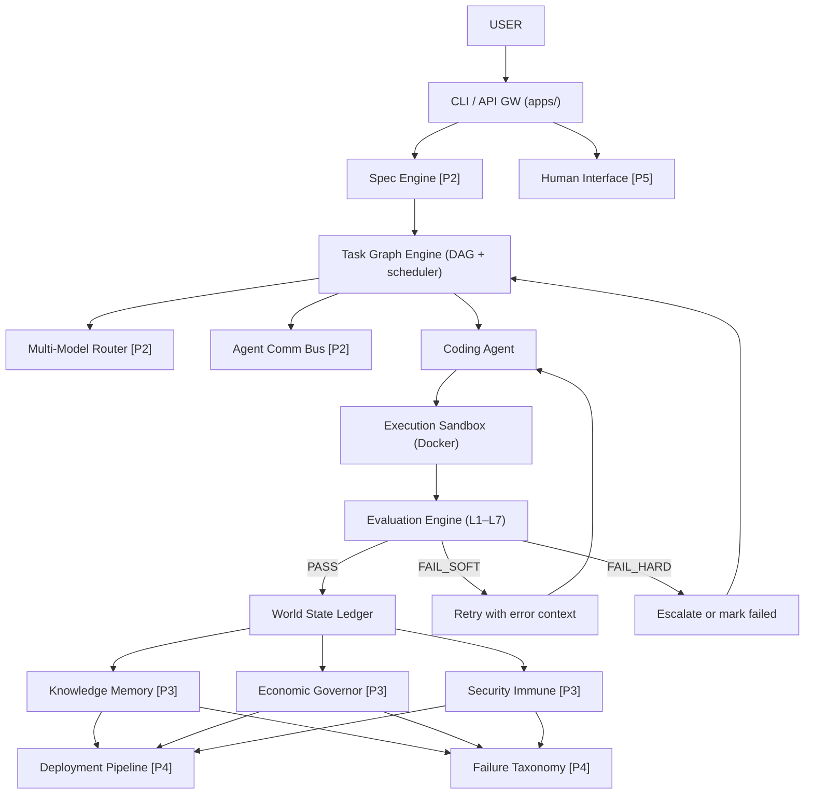
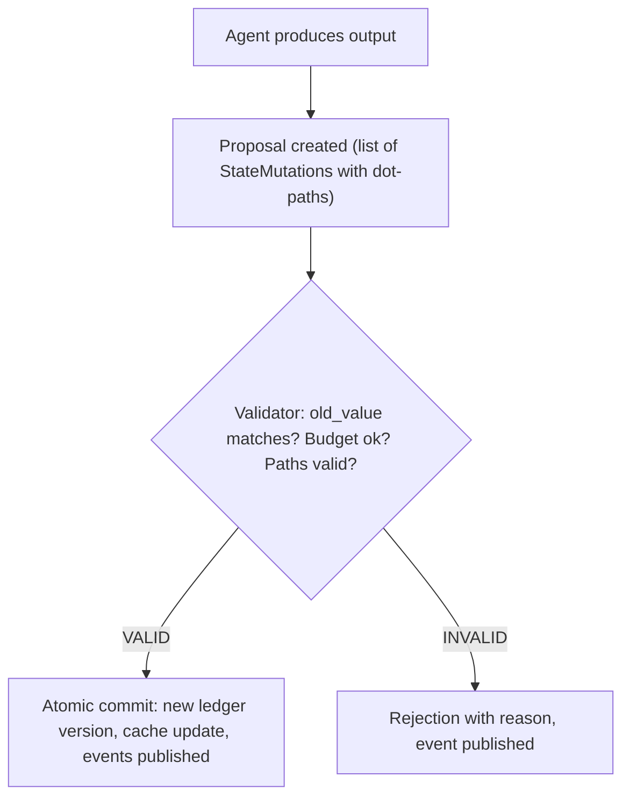

# ARCHITECT -- System Architecture

This document describes the design principles, component architecture, data flow, and technology decisions behind ARCHITECT.

---

## Design Principles

### 1. The loop is the product

ARCHITECT does not generate code; it runs the full engineering loop: specify, build, test, deploy, observe, repair, learn. Every component exists to close one part of that loop. A component that does not feed back into the loop has no place in the system.

### 2. Evaluation is harder than generation

LLMs can produce plausible code quickly. The hard problem is knowing whether that code is correct. ARCHITECT invests more architectural complexity in its 7-layer evaluation pipeline than in its code generation agent. Generation without evaluation is just autocomplete.

### 3. Agents are disposable, state is sacred

Any coding agent can be killed, restarted, or replaced mid-task. The World State Ledger and event log survive everything. All agent output goes through a proposal pipeline before it touches persistent state. No agent is trusted; every mutation is validated.

### 4. Economic pressure produces intelligence

Token budgets are not guardrails -- they are forcing functions. When an agent has limited retries and limited tokens, it must plan better, generate tighter code, and learn from failures. The Economic Governor (Phase 3) will make this pressure explicit and dynamic.

### 5. Humans stay in the loop until they choose to leave

ARCHITECT is designed for increasing autonomy, not full autonomy from day one. Every phase adds capability. The Human Interface (Phase 5) provides dashboards, escalation paths, and approval gates. Humans opt out gradually as trust builds.

---

## System Architecture

---

## Component Deep Dive

### 1. World State Ledger (Phase 1) -- IMPLEMENTED

**Purpose:** Single source of truth for the entire system. Every piece of mutable state -- task status, budget consumption, agent activity, build results, repo state -- lives in the versioned world state.

**Key abstractions:**

- `WorldState` -- Mutable top-level state snapshot containing `SpecState`, `RepoState`, `BuildState`, `InfraState`, `AgentState`, `BudgetState`
- `Proposal` -- An immutable mutation request containing a list of `StateMutation` objects
- `StateMutation` -- A single field-level change addressed by dot-path (e.g. `"budget.consumed_tokens"`) with `old_value` / `new_value` for optimistic concurrency
- `StateManager` -- Core class that handles reads (cache-first, DB fallback), proposal submission, validation, and atomic commits
- `EventLog` -- Append-only PostgreSQL event log with idempotent writes
- `StateCache` -- Redis-backed cache for hot state reads

**Delta-based storage:** Ledger rows store mutation diffs (`mutations` JSONB column) instead of full state snapshots. Full checkpoint snapshots are written every 20 versions (`is_checkpoint` flag). State reconstruction replays diffs from the nearest checkpoint. This eliminates quadratic storage growth.

**Communication:** Publishes events via Redis Streams (`proposal.created`, `proposal.accepted`, `proposal.rejected`, `ledger.updated`). All other components read state through the Ledger's API or Temporal activities.

**Implementation:** `services/world-state-ledger/` -- `state_manager.py`, `event_log.py`, `cache.py`, `models.py`, FastAPI routes, Temporal activities and worker.

---

### 2. Task Graph Engine (Phase 1) -- IMPLEMENTED

**Purpose:** Decomposes high-level specifications into a DAG of executable tasks, manages dependencies, and schedules work based on priority and readiness.

**Key abstractions:**

- `TaskDAG` -- NetworkX-backed directed acyclic graph where each node stores a `Task` and edges represent dependency relationships. Supports `from_tasks()` reconstruction from persisted tasks for crash recovery
- `TaskDecomposer` -- Converts a spec dict into a list of `Task` objects. Phase 1 uses deterministic decomposition (impl -> test -> review per module). Phase 2+ uses LLM-assisted decomposition. Handles markdown-fenced JSON from LLM responses
- `TaskScheduler` -- Picks the highest-priority ready task, manages lifecycle transitions (`PENDING -> RUNNING -> COMPLETED/FAILED`), enforces valid state transitions, handles retry logic. Supports `load_from_db()` for crash recovery
- `DistributedSchedulerLock` -- Redis-backed distributed lock for horizontal scaling. Uses SETNX for atomic task claiming, Redis sets for distributed completed-task tracking. Falls back to in-memory `asyncio.Lock` for single-instance deployments
- `Task` -- Frozen Pydantic model with `TaskId`, `TaskType`, `AgentType`, `ModelTier`, priority, dependencies, budget, retry history

**Communication:** Publishes task lifecycle events (`task.created`, `task.started`, `task.completed`, `task.failed`, `task.retried`). Reads from the World State Ledger. Persists to Postgres via `TaskRepository`.

**Implementation:** `services/task-graph-engine/` -- `graph.py` (DAG operations), `decomposer.py` (spec-to-tasks), `scheduler.py` (lifecycle management), Temporal workflows for orchestration.

---

### 3. Execution Sandbox (Phase 1) -- IMPLEMENTED

**Purpose:** Provides isolated, resource-limited Docker containers for running generated code. No code touches the host filesystem.

**Key abstractions:**

- `DockerExecutor` -- Creates containers, runs commands, writes/reads files via tar archives, destroys containers. Each sandbox session maps to one container. Supports optional DB persistence via `session_factory` and crash recovery via `load_active_sessions_from_db()`. Connects through a Docker socket proxy in production (restricting API surface to container lifecycle + exec)
- `SandboxSession` -- Tracks container ID, status, audit log, resource usage, and timestamps. Persisted to the `sandbox_sessions` DB table for crash recovery
- `SandboxSpec` -- Defines the sandbox configuration: base image, resource limits, task/agent IDs
- `SecurityValidator` -- Rejects dangerous commands (e.g. network access, privilege escalation) and suspicious file paths before execution
- `ResourceLimits` -- CPU, memory, disk, and timeout constraints applied to containers

**Communication:** Exposes a FastAPI HTTP API. Called by the Coding Agent (via `SandboxClient`) and the Evaluation Engine. Publishes sandbox lifecycle events.

**Implementation:** `services/execution-sandbox/` -- `docker_executor.py`, `security.py`, `resource_limits.py`, `file_manager.py`, `models.py`.

---

### 4. Evaluation Engine (Phase 1+2) -- IMPLEMENTED

**Purpose:** 7-layer evaluation pipeline that determines whether generated code meets quality standards. Evaluation is fail-fast by default -- a FAIL_HARD in an early layer skips remaining layers.

**Key abstractions:**

- `Evaluator` -- Orchestrates the layer pipeline. Runs each layer in sequence, publishes per-layer events, computes overall verdict. Configurable via `enabled_layers` setting
- `EvalLayerBase` -- Abstract base class defining the `evaluate(sandbox_session_id) -> LayerEvaluation` contract
- `CompilationLayer` (L1) -- Runs `python -m py_compile` on all Python files. FAIL_HARD on syntax errors
- `UnitTestLayer` (L2) -- Runs `pytest` in the sandbox. FAIL_SOFT on test failures, FAIL_HARD on complete breakage
- `IntegrationTestLayer` (L3) -- Runs `pytest -m integration`. FAIL_SOFT on failures, FAIL_HARD on collection errors
- `AdversarialLayer` (L4) -- Uses LLM to generate attack vectors (edge cases, injection, nulls), runs them in sandbox. Severity-based verdicts
- `SpecComplianceLayer` (L5) -- Fuzzy-matches acceptance criteria to test names. Score-based: >=50% met → FAIL_SOFT, <50% → FAIL_HARD
- `ArchitectureComplianceLayer` (L6) -- Checks for cross-service imports, runs ruff lint. Import violations → FAIL_HARD
- `RegressionLayer` (L7) -- Runs full test suite, compares against baseline count. Regressions → FAIL_HARD
- `EvaluationReport` -- Aggregates all layer results with an overall `EvalVerdict` (PASS / FAIL_SOFT / FAIL_HARD)
- `LayerEvaluation` -- Per-layer result containing the layer name, verdict, detailed results, and timestamps

**Communication:** Publishes `eval.layer_completed` and `eval.completed` events. Reads from sandboxes via `SandboxClient`. The adversarial layer uses `LLMClient` for attack vector generation. Results are consumed by the Task Graph Engine to determine task completion or retry.

**Implementation:** `services/evaluation-engine/` -- `evaluator.py`, `layers/base.py`, `layers/compilation.py`, `layers/unit_tests.py`, `layers/integration_tests.py`, `layers/adversarial.py`, `layers/spec_compliance.py`, `layers/architecture.py`, `layers/regression.py`, `models.py`.

---

### 5. Coding Agent (Phase 1) -- IMPLEMENTED

**Purpose:** LLM-powered agent that plans an implementation approach, generates code, writes it to a sandbox, runs tests, and iterates on failures.

**Key abstractions:**

- `CodingAgentLoop` -- Orchestrates the full agent lifecycle: plan -> generate -> write to sandbox -> test -> fix -> iterate
- `TaskPlanner` -- Uses the LLM to produce an implementation plan from spec and codebase context
- `CodeGenerator` -- Uses the LLM to produce source files and test files. Also has `fix_errors()` for iterating on failures
- `AgentRun` -- Input model containing task ID, spec context, codebase context, and configuration
- `AgentOutput` -- Result model with generated files, commit message, reasoning summary, and token usage
- `AgentConfig` -- Controls model ID, temperature, max tokens, and generation parameters

**Communication:** Calls the Execution Sandbox via `SandboxClient`. Uses `LLMClient` for Claude API calls. Publishes `agent.completed` events. Orchestrated by Temporal workflows.

**Implementation:** `services/coding-agent/` -- `agent.py`, `coder.py`, `planner.py`, `context_builder.py`, `models.py`, Temporal workflows and activities.

---

### 6. Spec Engine (Phase 2) -- IMPLEMENTED

**Purpose:** Transforms vague natural-language task descriptions into formal, testable specifications via Claude LLM. If the input is ambiguous, returns clarification questions instead of guessing.

**Key abstractions:**

- `TaskSpec` -- Frozen Pydantic model containing intent, constraints, success criteria (list of `AcceptanceCriterion`), file targets, assumptions, and open questions
- `AcceptanceCriterion` -- Each criterion has an ID, description, test type (`unit`/`integration`/`adversarial`), and `automated` flag
- `SpecParser` -- Takes raw text + optional clarification answers, calls Claude with a structured prompt, returns `SpecResult` (either a `TaskSpec` or a list of `ClarificationQuestion`)
- `SpecValidator` -- Validates spec completeness: non-empty intent, at least one criterion, no duplicate IDs
- `SpecificationWorkflow` -- Temporal workflow: parse → validate → return. Versioned with `workflow.patched("v1-spec-engine-baseline")`

**Communication:** Publishes `spec.created`, `spec.clarification_needed`, `spec.finalized` events. Uses `LLMClient` from `architect-llm` for Claude API calls.

**Implementation:** `services/spec-engine/` -- `parser.py`, `validator.py`, `models.py`, FastAPI routes (`POST /api/v1/specs`, `GET /api/v1/specs/{id}`, `POST /api/v1/specs/{id}/clarify`), Temporal workflow + activities. Port 8010.

---

### 7. Multi-Model Router (Phase 2) -- IMPLEMENTED

**Purpose:** Routes tasks to the cheapest model tier that can reliably handle them, with automatic escalation on failure.

**Key abstractions:**

- `ComplexityScorer` -- Scores task complexity 0.0--1.0 based on weighted factors: task type (review=0.8, fix_bug=0.7, implement=0.5, refactor=0.4, test=0.2), token estimate, description length, and keyword signals ("security", "concurrent", "migration" increase score)
- `Router` -- Maps complexity scores to model tiers via configurable thresholds (>0.7 → Tier 1/Opus, >0.3 → Tier 2/Sonnet, else → Tier 3/Haiku). Static overrides: `REVIEW_CODE` always Tier 1, `WRITE_TEST` always Tier 3
- `EscalationPolicy` -- Tracks failures per task. After `max_tier_failures` (default 2) at one tier, escalates: Tier 3 → Tier 2 → Tier 1 → human. Reset on success
- `RoutingDecision` -- Immutable record of task ID, selected tier, model ID, complexity score, and optional override reason
- `RoutingStats` -- Aggregate counters: total requests, tier distribution, escalation count, average complexity

**Communication:** Publishes `routing.decision` and `routing.escalation` events. Uses `CostTracker` from `architect-llm` for budget awareness.

**Implementation:** `services/multi-model-router/` -- `scorer.py`, `router.py`, `escalation.py`, `models.py`, FastAPI routes (`POST /api/v1/route`, `GET /api/v1/route/stats`), Temporal activity. Port 8011.

---

### 8. Codebase Comprehension (Phase 2) -- IMPLEMENTED

**Purpose:** Gives agents deep, accurate understanding of the target codebase through AST analysis. Pure Python -- no LLM calls needed.

**Key abstractions:**

- `ASTIndexer` -- Parses Python files with the `ast` module, extracts functions (sync/async, parameters, return types, decorators, calls), classes (bases, methods, docstrings), and imports (absolute/relative)
- `CallGraphBuilder` -- Builds forward and reverse call graphs from `FunctionDef.calls` across all indexed files. Key format: `file_path::function_name`
- `ConventionExtractor` -- Detects naming patterns (snake_case functions, PascalCase classes), file organization, common patterns (async usage, decorator prevalence), and test patterns
- `ContextAssembler` -- Given a task description, performs keyword-based search across the index, finds relevant files and symbols, discovers related test files, and builds import graphs
- `IndexStore` -- In-memory dict-based storage for `CodebaseIndex` instances with case-insensitive symbol search

**Communication:** Stateless service. No events published. Agents call the REST API to index directories and retrieve context.

**Subcomponents:**

- **tree-sitter AST indexer** (`TreeSitterIndexer`) -- Multi-language AST parsing (Python, JavaScript, TypeScript) using tree-sitter grammars. Supplements the built-in Python `ast` module indexer for broader language coverage.
- **sentence-transformers embedding generator** (`EmbeddingGenerator`) -- Produces 384-dimensional vector embeddings from code chunks using the `all-MiniLM-L6-v2` model via sentence-transformers. Falls back gracefully if sentence-transformers is not installed.
- **pgvector-based vector store** (`VectorStore`) -- Async PostgreSQL + pgvector store for code embeddings. Supports `store_embeddings`, `search` (cosine distance via `<=>` operator), `delete_index`, and `has_embeddings`. Stored in the `code_embeddings` table with columns for root path, file path, symbol info, embedding (Vector(384)), source chunk, and JSONB metadata.

**Implementation:** `services/codebase-comprehension/` -- `ast_indexer.py`, `call_graph.py`, `convention_extractor.py`, `context_assembler.py`, `index_store.py`, `embeddings.py`, `vector_store.py`, `models.py`, FastAPI routes (`POST /api/v1/index`, `GET /api/v1/context`, `GET /api/v1/symbols`, `POST /api/v1/index/embed`, `GET /api/v1/context/semantic`). Port 8012.

---

### 9. Agent Comm Bus (Phase 2) -- IMPLEMENTED

**Purpose:** Provides typed inter-agent messaging over NATS JetStream for coordination, context sharing, and escalation.

**Key abstractions:**

- `MessageBus` -- Wraps `nats.py` async client. Supports publish (fire-and-forget), subscribe (with optional queue groups for load balancing), and request/reply (with configurable timeout). Manages JetStream stream creation and subscription lifecycle
- `AgentMessage` -- Frozen Pydantic model with sender (`AgentId`), optional recipient (None = broadcast), `MessageType`, payload dict, correlation ID, and timestamp
- `MessageType` -- 8 typed variants: `task.assigned`, `task.completed`, `context.request`, `context.response`, `state.proposal`, `escalation`, `disagreement`, `knowledge.update`
- `DeadLetterHandler` -- In-memory DLQ for messages that fail processing. Supports inspection, retry, and purge
- `MessageStats` -- Aggregate counters: published, received, by-type breakdown, dead letter count, active subscriptions

**Communication:** Publishes `message.published` and `message.dead_lettered` events. All inter-agent messages flow through the NATS `ARCHITECT` stream.

**Implementation:** `services/agent-comm-bus/` -- `bus.py`, `dead_letter.py`, `models.py`, FastAPI routes (`GET /api/v1/bus/health`, `GET /api/v1/bus/stats`, `POST /api/v1/bus/publish`). Port 8013.

---

### 10. Knowledge Memory (Phase 3) -- STUB

**Purpose:** Will implement a 5-layer memory hierarchy: working memory (current task), episodic memory (past runs), semantic memory (patterns), procedural memory (learned techniques), and meta-cognitive memory (self-assessment).

---

### 11. Economic Governor (Phase 3) -- STUB

**Purpose:** Will enforce token budgets dynamically, adjust model tier allocation based on burn rate, pause low-priority work when budget runs low, and produce cost reports.

---

### 12. Security Immune (Phase 3) -- STUB

**Purpose:** Will scan generated code for security vulnerabilities, dependency risks, and policy violations before any code is committed or deployed.

---

### 13. Deployment Pipeline (Phase 4) -- STUB

**Purpose:** Will manage canary deployments, health monitoring, traffic shifting, and automatic rollback when deployed code degrades production metrics.

---

### 14. Failure Taxonomy (Phase 4) -- STUB

**Purpose:** Will classify failures into structured categories, track root causes, and feed failure patterns back into the Knowledge Memory so agents avoid repeating mistakes.

---

### 15. Human Interface (Phase 5) -- STUB

**Purpose:** Will provide a web dashboard for monitoring system state, reviewing agent output, approving deployments, and configuring escalation policies.

---

## Data Flow

The complete lifecycle of a task from submission to completion:

1. **User submits a spec** via the CLI (`architect submit`) or API Gateway. The spec contains a project description and module breakdown.

2. **Task Graph Engine decomposes the spec** into a DAG of tasks. In Phase 1, each module produces a triplet: implementation task -> test task -> review task. Dependencies are encoded as graph edges.

3. **Scheduler picks the next ready task.** A task is "ready" when all its predecessors in the DAG are completed. Among ready tasks, the highest-priority one is selected. The task transitions from `PENDING` to `RUNNING`.

4. **Coding Agent receives the task** via a Temporal workflow. It:
   - Builds a context window from the spec and codebase
   - Plans the implementation approach via Claude
   - Generates source code and test files via Claude
   - Writes files to an Execution Sandbox

5. **Evaluation Engine runs the pipeline** against the sandbox:
   - **L1 Compilation:** `py_compile` on all Python files
   - **L2 Unit Tests:** `pytest` execution with failure parsing
   - **L3 Integration Tests:** `pytest -m integration` for cross-module checks
   - **L4 Adversarial:** LLM-generated edge cases, injection tests, malicious inputs
   - **L5 Spec Compliance:** Acceptance criteria matched against passing tests
   - **L6 Architecture:** Cross-service import checks, lint violations
   - **L7 Regression:** Full test suite compared against baseline count

6. **If PASS:** The task is marked completed. The scheduler unblocks dependent tasks and picks the next one. A proposal is submitted to the World State Ledger recording the state change.

7. **If FAIL_SOFT:** The task has retries remaining. Error context is fed back to the Coding Agent, which calls `fix_errors()` to produce a corrected version. The loop repeats from step 4.

8. **If FAIL_HARD:** The task is marked failed. If retries are exhausted, the task is escalated (logged, and in Phase 5, surfaced to the human dashboard). Dependent tasks are blocked.

9. **World State Ledger records all transitions.** Every status change, proposal, and evaluation result is persisted as an event in the append-only event log and as a versioned state snapshot.

---

## State Management

### Proposal-gated mutations

No component directly mutates the world state. Instead:

Each `StateMutation` contains:

- `path`: Dot-separated field address (e.g. `"budget.consumed_tokens"`)
- `old_value`: Expected current value (for optimistic concurrency check)
- `new_value`: The value to write

### Event sourcing

All state changes are logged as events in an append-only PostgreSQL table with idempotent writes (via `idempotency_key` with ON CONFLICT DO NOTHING). Events carry type, timestamp, correlation ID, and payload.

Events are also published to Redis Streams for real-time consumption by other components. Stream names follow the pattern `architect:{event_type}` (e.g. `architect:task.completed`).

### Caching

Redis serves as the hot cache for the current world state snapshot. The `StateCache` class provides `get_current_state()` and `set_current_state()`. On cache miss, the StateManager falls back to the latest PostgreSQL ledger row.

---

## Multi-Model Routing (Implemented)

The system defines three model tiers in `architect_common.enums.ModelTier`:

| Tier                | Class              | Model ID                   | Use Cases                                                              |
| ------------------- | ------------------ | -------------------------- | ---------------------------------------------------------------------- |
| **Tier 1** (Opus)   | Maximum capability | `claude-opus-4-20250514`   | Architecture decisions, security review, code review (static override) |
| **Tier 2** (Sonnet) | Balanced           | `claude-sonnet-4-20250514` | Feature implementation, bug fixes, task decomposition                  |
| **Tier 3** (Haiku)  | Fast and cheap     | `claude-haiku-3-20250305`  | Scaffolding, test writing (static override), formatting, simple fixes  |

The Multi-Model Router (`services/multi-model-router/`) dynamically assigns tiers based on:

- **Complexity scoring** -- Weighted factors: task type (0.2--0.8), token estimate (linear to 100k), description length, and keyword signals
- **Static overrides** -- `REVIEW_CODE` always routes to Tier 1, `WRITE_TEST` always routes to Tier 3
- **Threshold routing** -- Score > 0.7 → Tier 1, > 0.3 → Tier 2, else Tier 3
- **Escalation policy** -- After 2 failures at a tier, automatically escalates: Tier 3 → Tier 2 → Tier 1 → human. Resets on success

---

## Evaluation Layers

| Layer | Name              | Status      | Verdict on Failure | Auto-fix Behavior                                             |
| ----- | ----------------- | ----------- | ------------------ | ------------------------------------------------------------- |
| L1    | Compilation       | Implemented | FAIL_HARD          | Not retryable -- syntax errors must be fixed by regeneration  |
| L2    | Unit Tests        | Implemented | FAIL_SOFT          | Errors fed back to agent for iterative fixing                 |
| L3    | Integration Tests | Implemented | FAIL_SOFT          | Errors fed back with broader context                          |
| L4    | Adversarial       | Implemented | FAIL_SOFT          | LLM-generated edge cases and attack vectors, severity-based   |
| L5    | Spec Compliance   | Implemented | FAIL_SOFT/HARD     | Fuzzy-matches criteria to tests; <50% met → FAIL_HARD         |
| L6    | Architecture      | Implemented | FAIL_SOFT/HARD     | Cross-service import violations → FAIL_HARD, lint → FAIL_SOFT |
| L7    | Regression        | Implemented | FAIL_HARD          | Full suite must pass; count must meet or exceed baseline      |

The evaluator runs layers in order. When `fail_fast=True` (the default), a FAIL_HARD verdict in any layer short-circuits the remaining layers.

---

## Technology Decisions

### Why uv workspaces

The monorepo contains 24 Python packages (6 libs, 15 services, 2 apps, 1 root). uv workspaces provide:

- Single lockfile (`uv.lock`) for reproducible installs across all packages
- Fast dependency resolution and installation (10--100x faster than pip)
- Workspace-aware `--all-packages` flag for installing everything in one command
- Editable installs by default within the workspace

### Why Temporal

The task execution loop involves multi-step workflows that may fail partway through (LLM call -> sandbox execution -> evaluation). Temporal provides:

- **Durable execution:** Workflows survive process restarts. If a worker crashes mid-task, Temporal replays the workflow from the last checkpoint
- **Built-in retries:** Activity-level retry policies with exponential backoff
- **Visibility:** The Temporal UI (port 8080) shows running workflows, their state, and history
- **Timeouts:** Per-activity and per-workflow timeouts prevent runaway tasks

### Why proposal-gated state

Direct state mutation by agents would create race conditions and make debugging impossible. The proposal pipeline provides:

- **Audit trail:** Every state change has a proposal ID, agent ID, rationale, and timestamp
- **Optimistic concurrency:** The `old_value` check in each mutation prevents lost updates when multiple agents try to modify the same field
- **Rollback-friendly:** State can be reconstructed at any version by replaying diffs from the nearest checkpoint
- **Budget enforcement:** The validator rejects any proposal that would drive `remaining_tokens` below zero

### Why Docker sandboxing

Generated code is untrusted by definition. Docker containers provide:

- **Filesystem isolation:** Code runs in `/workspace` inside the container; the host filesystem is never exposed
- **Resource limits:** CPU, memory, and timeout constraints prevent runaway processes
- **Security scanning:** Commands are validated against an allowlist before execution (no network access, no privilege escalation, no host mounts)
- **Reproducibility:** Each sandbox starts from a known base image with deterministic state
- **User isolation:** Commands run as UID 1000 (non-root) inside the container
- **Docker socket proxy:** Production deployments use Tecnativa docker-socket-proxy to restrict Docker API access (only container lifecycle + exec; images, volumes, networks, swarm blocked)

### Why Pydantic frozen models

All domain models (`Task`, `Proposal`, `StateMutation`, `EvaluationReport`, etc.) inherit from `ArchitectBase`, which sets `frozen=True`:

- **Immutability:** Once created, a domain model cannot be accidentally mutated. State changes produce new instances via `model_copy(update={...})`
- **Thread safety:** Frozen models can be safely shared across async tasks and Temporal activities
- **Hashability:** Frozen models can be used as dict keys or set members
- **Correctness:** Eliminates a large class of bugs where shared mutable state is modified in unexpected order

The one exception is `WorldState`, which inherits from `MutableBase` because it serves as an accumulator that is built up through successive mutations before being committed as a frozen ledger snapshot.

---

## Security Architecture

### API Authentication

The API Gateway enforces Bearer token authentication on all non-health endpoints (ADR-005). Keys are configured via `ARCHITECT_GATEWAY_API_KEYS_RAW` (comma-separated). Constant-time comparison via `hmac.compare_digest()` prevents timing attacks. Health and OpenAPI endpoints are exempt. Auth can be disabled for local dev via `ARCHITECT_GATEWAY_AUTH_ENABLED=false`.

### Prompt Injection Mitigation

User-provided text (specs, task descriptions) is wrapped in `<user_input>` delimiter tags before inclusion in LLM prompts. A detection function scans for common injection markers (e.g. "IGNORE PREVIOUS INSTRUCTIONS") and logs warnings. Post-generation code scanning checks for suspicious patterns (dangerous function calls, outbound network calls) as defense-in-depth. The sandbox is the enforcement layer.

### Credential Management

No hardcoded credentials anywhere. Docker Compose uses `${VAR:?error}` syntax for fail-fast on missing secrets. `scripts/dev-setup.sh` auto-generates strong passwords via `openssl rand -hex 16`. Redis requires authentication (`--requirepass`). Credentials are redacted from log output.

### Rate Limiting & Request Controls

The API Gateway includes sliding-window rate limiting (default 60 req/min, keyed by API key or client IP), request body size limits (1MB default, returns 413), and security headers (CSP, HSTS in non-dev, X-Frame-Options, X-Content-Type-Options).

---

## Observability

### Tracing

The `architect-observability` library provides one-call setup for OpenTelemetry tracing on any FastAPI service. Traces are exported via OTLP gRPC to Jaeger (port 4317). FastAPI requests and outbound httpx calls are auto-instrumented. The Jaeger UI is available at http://localhost:16686.

### Metrics

Prometheus metrics are exposed on `/metrics` for every instrumented service via `prometheus-fastapi-instrumentator`. Prometheus scrapes all 10 services (gateway + 9 backends) every 15 seconds. Grafana (port 3001) provides visualization.

### Logging

All services use `structlog` with ISO timestamps, context variables, and configurable JSON output. Logs go to stderr.

### Infrastructure

| Service | Port | Purpose |
|---------|------|---------|
| Jaeger | 16686 (UI), 4317 (OTLP) | Distributed tracing |
| Prometheus | 9090 | Metrics collection |
| Grafana | 3001 | Metrics dashboards |
| Temporal UI | 8080 | Workflow visibility |
| NATS Monitoring | 8222 | Message bus health |
