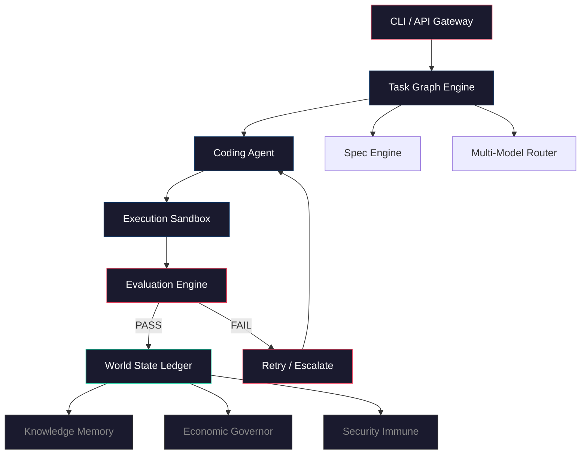

# ARCHITECT

**Autonomous Recursive Coding Hierarchy for Integrated Task Engineering and Execution**

> One system. One loop. Every engineer replaced.

---

[](https://www.python.org/downloads/)
[](#testing)
[](#testing)
[](http://mypy-lang.org/)
[](LICENSE)
[](#roadmap)

## What is this?

ARCHITECT takes a project spec and turns it into working, tested code — autonomously. It decomposes specs into a task DAG, assigns LLM-powered agents, executes in Docker sandboxes, evaluates through 7 layers, and records every mutation in a proposal-gated ledger. 14 components. 5 build phases. 2 fully implemented.

## How it works

```
spec → Spec Engine parses intent → Task Graph Engine decomposes into DAG →
Coding Agent generates code via Claude → Execution Sandbox runs it in Docker →
Evaluation Engine judges across 7 layers → pass? commit to World State Ledger :
fail? retry or escalate
```

Every state change goes through a **proposal → validate → commit** pipeline. Nothing mutates without a paper trail.



## Quick start

You need Python 3.12+, Docker, and [uv](https://docs.astral.sh/uv/).

```bash
git clone https://github.com/saatvik333/osoleer-agi.git
cd osoleer-agi
make install        # install all workspace packages
make run-all        # start infra + services + gateway + dashboard
```

That's it. Dashboard at [localhost:3000](http://localhost:3000), API at [localhost:8000](http://localhost:8000), Temporal UI at [localhost:8080](http://localhost:8080).

Tear it all down with `make stop-all`.

<details>
<summary><b>Step by step</b></summary>

```bash
make install        # install deps
make infra-up       # postgres, redis, temporal, nats
make migrate        # run alembic migrations
make test           # 739 tests, ~16s
make run-all        # everything
```

</details>

## Components

| # | Component | Phase | What it does |
|---|-----------|-------|--------------|
| 1 | **Spec Engine** | P2 | NL-to-formal-spec via Claude, clarification detection |
| 2 | **World State Ledger** | P1 | Proposal-gated, versioned single source of truth |
| 3 | **Task Graph Engine** | P1 | DAG decomposition, dependency tracking, priority scheduling |
| 4 | **Multi-Model Router** | P2 | Complexity scoring + tier routing with escalation |
| 5 | **Codebase Comprehension** | P2 | AST indexing, embeddings, semantic search |
| 6 | **Agent Comm Bus** | P2 | NATS JetStream pub/sub with dead letter handling |
| 7 | **Execution Sandbox** | P1 | Docker-isolated execution, seccomp, resource limits |
| 8 | **Evaluation Engine** | P1 | 7-layer eval: compile, test, adversarial, spec, arch, regression |
| 9 | Knowledge Memory | P3 | _stub_ |
| 10 | Economic Governor | P3 | _stub_ |
| 11 | Security Immune | P3 | _stub_ |
| 12 | Deployment Pipeline | P4 | _stub_ |
| 13 | Failure Taxonomy | P4 | _stub_ |
| 14 | Human Interface | P5 | _stub_ |
| -- | **Coding Agent** | P1 | Plan/generate/test/fix loop powered by Claude |

## Architecture

```
osoleer-agi/
├── libs/                       # shared libraries (no cross-service imports)
│   ├── architect-common/       # types, errors, config, interfaces
│   ├── architect-db/           # ORM models, repositories, alembic migrations
│   ├── architect-events/       # redis streams pub/sub + DLQ
│   ├── architect-llm/          # claude client, cost tracker, rate limiter
│   ├── architect-sandbox-client/
│   └── architect-testing/      # shared test factories
├── services/                   # the 14 components
│   ├── world-state-ledger/     # [P1] temporal workflows + fastapi routes
│   ├── task-graph-engine/      # [P1] networkx DAG + scheduler
│   ├── execution-sandbox/      # [P1] docker executor + security
│   ├── evaluation-engine/      # [P1] 7-layer pipeline
│   ├── coding-agent/           # [P1] llm-powered code gen
│   ├── spec-engine/            # [P2]
│   ├── multi-model-router/     # [P2]
│   ├── codebase-comprehension/ # [P2] tree-sitter + sentence-transformers
│   └── agent-comm-bus/         # [P2] nats jetstream
├── apps/
│   ├── api-gateway/            # unified fastapi gateway
│   ├── cli/                    # typer CLI
│   └── dashboard/              # react + typescript + tailwind (bun)
├── infra/                      # docker-compose, dockerfiles, seccomp profiles
└── tests/                      # integration + e2e suites
```

Services never import each other. Communication happens through Temporal workflows and the event bus.

## Tech stack

**Runtime:** Python 3.12 &middot; FastAPI &middot; SQLAlchemy (async) &middot; Pydantic v2 (frozen models) &middot; structlog

**Infrastructure:** PostgreSQL 16 (pgvector) &middot; Redis 7 &middot; Temporal &middot; NATS JetStream &middot; Docker

**AI:** Anthropic SDK (Claude) &middot; sentence-transformers &middot; tree-sitter &middot; PromptFoo

**Frontend:** React 19 &middot; TypeScript 5.6 &middot; Vite 8 &middot; Tailwind &middot; Bun

**Tooling:** uv &middot; Ruff &middot; mypy (strict) &middot; pytest &middot; Alembic &middot; pre-commit

## Development

```bash
make install          # install everything
make lint             # ruff check + format
make format           # auto-format
make typecheck        # mypy strict
make test             # unit tests (~16s)
make test-integration # needs infra
make test-e2e         # full lifecycle
make test-all         # everything
make dev              # infra-up + migrate
make run-all          # the whole system
make stop-all         # tear it down
make clean            # nuke caches
```

## Testing

739 tests. 90% coverage. ~16 seconds.

- Unit tests colocated in each package
- Integration tests in `tests/integration/` (need `make infra-up`)
- E2E tests in `tests/e2e/` (full task lifecycle)
- [PromptFoo](https://www.promptfoo.dev/) LLM regression suites with adversarial inputs
- mypy strict + ruff enforced on every commit via pre-commit hooks

## Roadmap

| Phase | Name | Status |
|-------|------|--------|
| **P1** | Foundation | **done** &mdash; WSL, Task Graph, Sandbox, Eval Engine, Coding Agent |
| **P2** | Multi-Agent | **done** &mdash; Spec Engine, Router, Codebase Comprehension, Comm Bus, Dashboard |
| **P3** | Intelligence | _next_ &mdash; Knowledge Memory, Economic Governor, Security Immune |
| **P4** | Production | _planned_ &mdash; Deployment Pipeline, Failure Taxonomy |
| **P5** | Scale | _planned_ &mdash; Human Interface |

## Contributing

See [CONTRIBUTING.md](CONTRIBUTING.md). The short version:

1. Fork and branch from `main`
2. `make install && make test` to verify
3. Follow [Conventional Commits](https://www.conventionalcommits.org/)
4. PR against `main`

## License

Dual-licensed:

- **Non-commercial** &mdash; [PolyForm Noncommercial License 1.0.0](LICENSE). Free for personal projects, research, study, and contributions.
- **Commercial** &mdash; separate licence required. See [LICENSE-COMMERCIAL.md](LICENSE-COMMERCIAL.md).

Copyright &copy; 2026 [Saatvik](https://github.com/saatvik333). All rights reserved.
