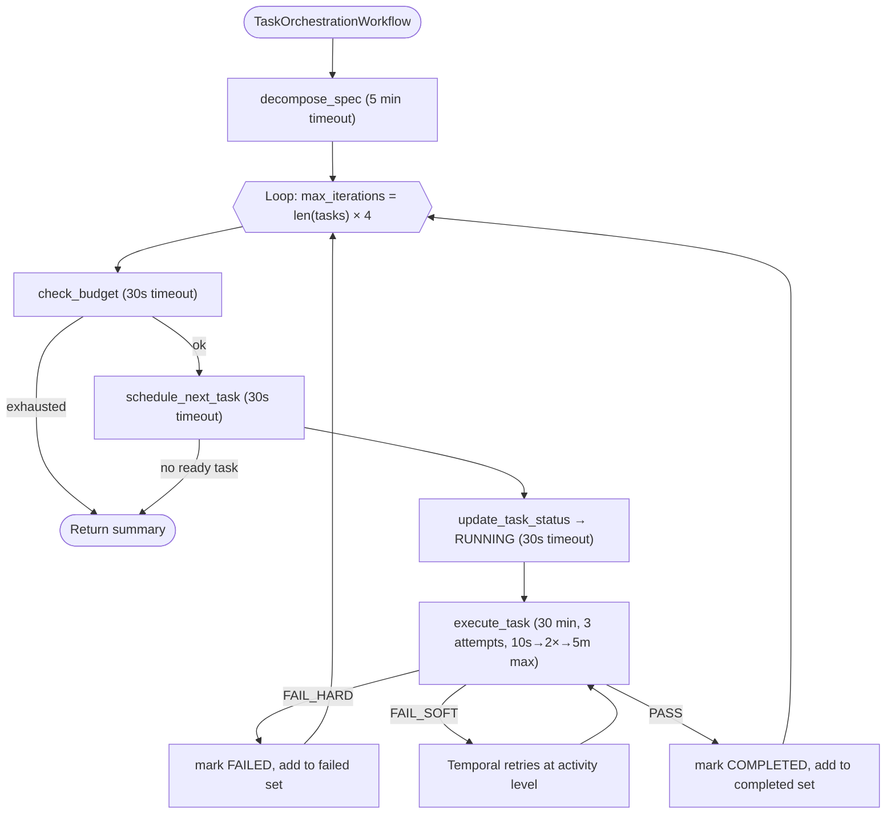

# ADR-002: Temporal for Workflow Orchestration

## Status

Accepted

## Context

ARCHITECT requires durable, retryable, and observable orchestration of multi-step workflows that span several services. The core loop -- decompose a specification into tasks, dispatch each task to a coding agent, execute code in a sandbox, evaluate the results, retry on failure, and commit on success -- involves coordination across the Task Graph Engine, Execution Sandbox, Evaluation Engine, and Coding Agent.

A single task execution involves:

1. Receiving a task from the scheduler.
2. Building an LLM context window (may fail if context is too large).
3. Calling Claude to generate an implementation plan (may fail due to rate limits or token budget).
4. Calling Claude to generate code (may fail or produce invalid output).
5. Writing files to an execution sandbox (may fail if Docker is unavailable).
6. Running evaluation layers sequentially (each may fail independently).
7. Submitting a proposal to the World State Ledger (may be rejected due to concurrency conflict).
8. Retrying steps 3-7 up to N times on `FAIL_SOFT` verdicts.

This orchestration has several hard requirements:

1. **Durability**: If a service crashes mid-workflow, the orchestration must resume from where it left off, not restart from scratch. A single spec can trigger hours of LLM calls and sandbox executions; losing that progress is unacceptable.
2. **Retries with backoff**: Individual steps (LLM calls, sandbox commands, evaluations) can fail transiently. The orchestrator must retry with configurable policies (initial interval, backoff coefficient, maximum attempts, maximum interval).
3. **Timeouts**: Each step needs a deadline. Decomposition gets 5 minutes. Task execution gets 30 minutes. Status updates get 30 seconds. Without enforced timeouts, a hung LLM call or stuck container can block the entire pipeline.
4. **Observability**: Operators need to see which workflows are running, which step each is on, what failed, and what was retried. This must be available without custom instrumentation.
5. **Versioning**: As workflow logic evolves across phases, running workflows must complete under their original logic while new workflows use updated logic.

Alternatives considered:

- **Celery**: Widely used but lacks native workflow orchestration, durable state, and per-step timeout enforcement. Retry policies are per-task, not per-step within a workflow. If a Celery worker crashes mid-chain, the chain state is lost. No built-in UI for workflow debugging.
- **Apache Airflow**: Designed for batch DAG scheduling, not for real-time event-driven workflows. Airflow's scheduler polling interval adds unacceptable latency to the tight agent loop. Its DAG-file-based definition model is a poor fit for dynamically generated task graphs.
- **Custom state machine on Redis/Postgres**: Would provide full control but requires implementing durability, retries, timeouts, replay, and observability from scratch -- months of engineering effort with significant bug surface.
- **AWS Step Functions / GCP Workflows**: Cloud-specific, vendor lock-in, limited local development story, and pricing that scales poorly with the volume of LLM-driven workflows ARCHITECT will run.

## Decision

Use **Temporal.io** with the **Python SDK** (`temporalio`) as the workflow orchestration backbone for ARCHITECT.

Each service defines its workflows and activities in a `temporal/` sub-package:

- **Workflows** (`temporal/workflows.py`) define the orchestration logic as deterministic Python functions decorated with `@workflow.defn` and `@workflow.run`.
- **Activities** (`temporal/activities.py`) contain the actual work (LLM calls, sandbox commands, database updates) decorated with `@activity.defn`.
- **Workers** poll from service-specific task queues to ensure worker isolation.

### Phase 1 Workflows

| Workflow                     | Service            | Task Queue            | Description                                   |
|------------------------------|--------------------|-----------------------|-----------------------------------------------|
| `TaskOrchestrationWorkflow`  | Task Graph Engine  | `task-graph-engine`   | Full spec decomposition and execution loop    |
| `EvaluationWorkflow`         | Evaluation Engine  | `evaluation-engine`   | Multi-layer evaluation pipeline               |

### Activity Timeout Configuration

| Activity            | Start-to-Close Timeout | Retry Policy                                      |
|---------------------|------------------------|---------------------------------------------------|
| `decompose_spec`    | 5 minutes              | Default (3 attempts)                               |
| `schedule_next_task`| 30 seconds             | Default                                            |
| `update_task_status`| 30 seconds             | Default                                            |
| `execute_task`      | 30 minutes             | Up to 3 attempts, 10s initial, 2x backoff, 5m max |
| `check_budget`      | 30 seconds             | Default                                            |
| `run_evaluation`    | 10 minutes             | Default                                            |

### Orchestration Flow

The `TaskOrchestrationWorkflow` implements the main loop:

1. Calls `decompose_spec` to break the specification into tasks and build a DAG.
2. Enters an orchestration loop bounded by `max_iterations = len(tasks) * 4` to prevent infinite loops.
3. Calls `check_budget` before each iteration -- exits if budget is exhausted.
4. Calls `schedule_next_task` to get the highest-priority ready task.
5. Marks the task as `RUNNING` via `update_task_status`.
6. Calls `execute_task` with the full retry policy.
7. Based on the verdict:
   - `PASS`: marks `COMPLETED`, adds to completed set.
   - `FAIL_HARD`: marks `FAILED`, adds to failed set.
   - `FAIL_SOFT`: marks `FAILED` (Temporal's retry policy handles retries at the activity level).
8. Returns a summary dict with total/completed/failed counts and per-task results.

### Infrastructure

Temporal server runs as a Docker container (`temporalio/auto-setup`) backed by the shared Postgres database. The Temporal UI (`temporalio/ui`) is exposed on port 8080 for operational visibility.

Configuration is managed via `TemporalConfig` (env prefix `ARCHITECT_TEMPORAL_`):

| Field       | Default       | Description                    |
|-------------|---------------|--------------------------------|
| host        | `localhost`   | Temporal server host           |
| port        | `7233`        | Temporal gRPC port             |
| namespace   | `architect`   | Temporal namespace             |
| task_queue  | `architect-tasks` | Default task queue         |

## Consequences

### Positive

- **Durable execution**: Workflows survive service restarts, deployments, and infrastructure failures. Temporal replays the workflow event history to reconstruct state, so no progress is lost. Expensive LLM calls that already succeeded are not re-executed.
- **Built-in retries**: Per-activity retry policies with configurable initial interval, backoff coefficient, maximum interval, and maximum attempts. The `TaskOrchestrationWorkflow` uses 10-second initial interval with 2x backoff and a 5-minute maximum interval for task execution -- this is declared in the workflow, not scattered across service code.
- **Enforced timeouts**: Start-to-close timeouts on every activity prevent hung operations. Activities use `activity.heartbeat()` to signal liveness; if heartbeats stop, Temporal detects the failure and schedules the activity on another worker.
- **Crash recovery**: If a worker crashes mid-activity, Temporal detects the missing heartbeat and schedules the activity on another worker. This is transparent to the workflow.
- **Workflow versioning**: As orchestration logic changes across phases, Temporal's versioning API ensures running workflows complete under their original logic while new workflows use updated logic.
- **Observability out of the box**: The Temporal UI (port 8080) shows all running and completed workflows, their event histories, pending activities, retries, and failures. No custom dashboards needed for Phase 1.
- **Worker isolation**: Each service runs its own worker polling a dedicated task queue (`task-graph-engine`, `evaluation-engine`, `coding-agent`), preventing one service's workload from starving another.

### Negative

- **Infrastructure complexity**: Temporal server is an additional stateful service to deploy, monitor, and maintain. It requires its own database schemas (created via `temporalio/auto-setup`), which are stored in separate `temporal` and `temporal_visibility` Postgres databases.
- **Learning curve**: Temporal's deterministic workflow model requires developers to understand constraints: no non-deterministic operations in workflow code (no I/O, no random, no `datetime.now()`). All side effects must be in activities. Imports of non-deterministic modules require `workflow.unsafe.imports_passed_through()`.
- **Debugging indirection**: Errors in activity code appear in the Temporal event history, which adds a layer of indirection compared to direct function calls. Stack traces may be less straightforward.
- **Local development overhead**: The Temporal server must be running for any workflow-dependent functionality to work locally. The docker-compose setup mitigates this, but adds to `make infra-up` startup time and resource consumption.
- **Replay overhead**: For very long workflows with many activities, replay can become slow. This is mitigable with continue-as-new patterns for long-running loops.

### Neutral

- Temporal's Python SDK uses `workflow.unsafe.imports_passed_through()` for importing non-deterministic modules in workflow code. This is a documented pattern already used in the codebase.
- The decision does not preclude adding other orchestration mechanisms (e.g., simple async task queues for lightweight operations) alongside Temporal in future phases.
- Temporal's gRPC API can be used for programmatic workflow management beyond what the UI provides.
- Each service can define its own activities independently; there is no shared activity registry across services.
