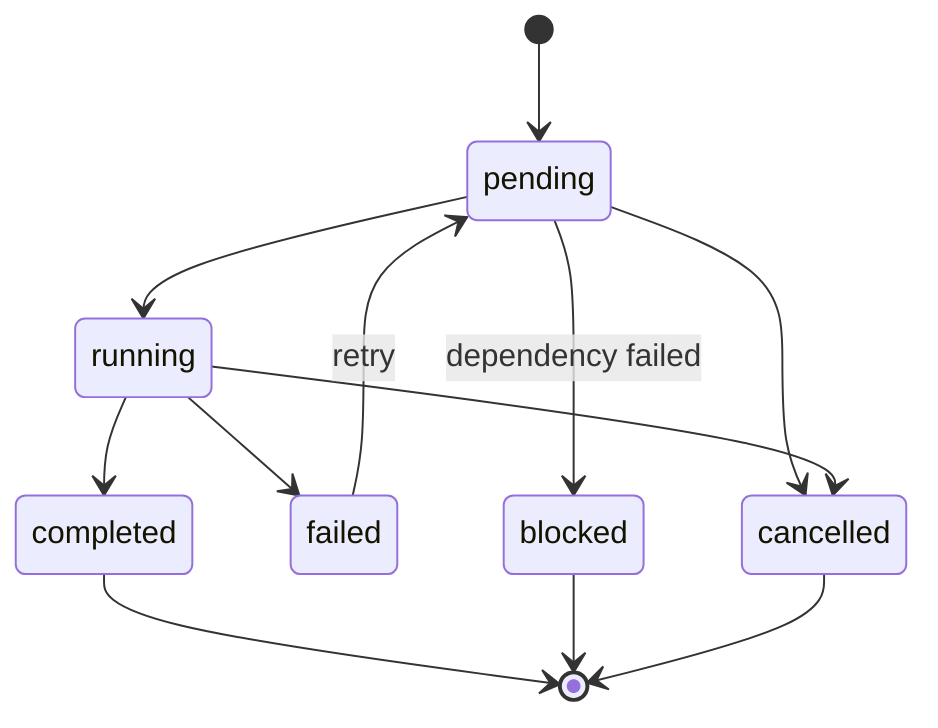
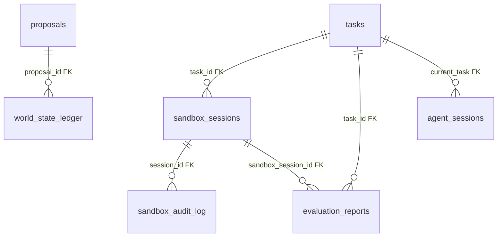

# Phase 1: Detailed Design Document

## Overview

Phase 1 proves the end-to-end core loop: **spec -> decompose -> code -> test -> evaluate -> commit**. It establishes the architectural patterns, state management foundation, and inter-component communication contracts that all future phases build upon.

## Goals

1. **Prove the core loop works.** A user submits a specification via the CLI; ARCHITECT decomposes it into tasks, generates code via LLM, executes and tests it in a sandbox, evaluates the results, and produces committable output.
2. **Establish patterns for all future phases.** Every component follows the same structural conventions: Temporal workflows for orchestration, FastAPI for synchronous APIs, Redis Streams for event publishing, and Pydantic models for domain objects.
3. **Build the state management foundation.** The World State Ledger provides a single, versioned, event-sourced source of truth that all other components observe and mutate through a controlled proposal pipeline.

## Phase 1 Components

The five active components in Phase 1 are:

| Component            | Service Port | Temporal Task Queue       |
|----------------------|-------------|---------------------------|
| World State Ledger   | 8001        | `world-state-ledger`      |
| Task Graph Engine    | 8003        | `task-graph-engine`       |
| Execution Sandbox    | 8007        | `execution-sandbox`       |
| Evaluation Engine    | 8008        | `evaluation-engine`       |
| Coding Agent         | 8009        | `coding-agent`            |

---

## Component Design

### World State Ledger

The World State Ledger is the system's single source of truth. It maintains a versioned, append-only history of the entire ARCHITECT state and enforces that all mutations flow through the proposal pipeline.

#### Proposal-Gated Mutation Model

No component may modify state directly. Instead, agents submit **proposals** that describe the intended changes. Each proposal contains:

- `agent_id` and `task_id` identifying who and why
- A list of `mutations`, each specifying a dot-path (e.g., `budget.consumed_tokens`), the expected `old_value`, and the desired `new_value`
- An optional `rationale` string

The commit process performs **compare-and-swap** (CAS) validation: if any `old_value` does not match the current ledger state, the proposal is rejected. On acceptance, a new ledger version is created atomically and the proposal is linked to it.

Proposal lifecycle: `pending` -> `accepted` | `rejected` (tracked via `ProposalVerdict` enum).

#### Event Sourcing with Append-Only Log

Every state change, proposal decision, task transition, and agent action is recorded as an immutable event in the `event_log` table. Events are typed via the `EventType` enum (21 event types in Phase 1) and carry structured payloads. The append-only log enables:

- Full audit trail of every system action
- Replay capability for debugging and analysis
- Time-travel debugging by correlating events with ledger versions
- Idempotent event processing via the `idempotency_key` column

Events are also published in real-time to Redis Streams (stream per event type, e.g., `architect:task.completed`).

#### Redis Cache

The cache sits in front of Postgres to serve hot reads without database round-trips. It stores the full serialized world state under `wsl:current_state` and individual field lookups under `wsl:field:{path}`.

TTL tiers:

| Tier    | TTL     | Use Case                                      |
|---------|---------|-----------------------------------------------|
| Hot     | 30s     | Current state snapshot (default)               |
| Warm    | 5min    | Field-level lookups for active tasks           |
| Session | 20min   | Extended cache for long-running agent sessions |

Cache invalidation occurs automatically on TTL expiry and explicitly when a proposal is committed outside the normal path.

#### Postgres Storage

The `world_state_ledger` table uses `BIGSERIAL` for the version column (auto-incrementing), stores the full state snapshot as JSONB, and links each version to the proposal that created it via `proposal_id` (FK to `proposals`).

### Task Graph Engine

The Task Graph Engine receives specifications and decomposes them into executable tasks organized as a directed acyclic graph (DAG).

#### NetworkX-Based DAG

The engine uses NetworkX to build and manage the task dependency graph. Key operations:

- **Add tasks** to the graph as nodes with metadata
- **Add dependencies** as directed edges
- **Topological sort** to determine a valid execution order
- **Cycle detection** during validation to prevent deadlocks
- **Ready-task identification** by finding nodes with all dependencies completed

#### Phase 1 Decomposition Strategy

In Phase 1, decomposition is linear: each module in the specification produces a triplet of tasks:

1. **implement_feature** -- Generate the source code (agent_type: `coder`)
2. **write_test** -- Generate unit tests (agent_type: `tester`)
3. **review_code** -- Review the implementation (agent_type: `reviewer`)

Dependencies are linear within a triplet: implement -> test -> review. Cross-module dependencies are expressed via the priority system.

#### Priority-Weighted Scheduling

When multiple tasks are ready (all dependencies satisfied), the scheduler selects the highest-priority task first. Priority is set during decomposition based on the module's priority field in the specification and the task type (implementation tasks get higher priority than reviews).

#### Task State Machine

Tasks transition through states with validation rules:



Valid transitions are enforced -- for example, a `completed` task cannot move to `running`. The `StatusEnum` covers all six states: `pending`, `running`, `completed`, `failed`, `blocked`, `cancelled`.

#### Task Budget

Each task carries a `TaskBudget` with limits that prevent runaway execution:

| Field                  | Default   | Description                     |
|------------------------|-----------|-------------------------------------|
| max_tokens             | 100,000   | Maximum LLM tokens                  |
| max_time               | 30 min    | Maximum wall-clock time             |
| max_retries            | 3         | Maximum retry attempts              |
| max_output_size_bytes  | 1,000,000 | Maximum total output size           |

#### Temporal Workflow for Orchestration

The `TaskOrchestrationWorkflow` is the main orchestration entry point. It:

1. Calls the `decompose_spec` activity to break the spec into tasks
2. Enters a loop that checks budget, identifies the next ready task, executes it, and evaluates the result
3. Handles soft failures (retry via Temporal's retry policy: initial 10s, backoff 2x, max 5min interval) and hard failures (mark as failed, stop)
4. Exits when all tasks pass or the budget is exhausted
5. Returns a summary with counts and per-task results

Activities: `decompose_spec`, `schedule_next_task`, `update_task_status`, `execute_task`, `check_budget`

### Execution Sandbox

The Execution Sandbox provides Docker-based isolation for running generated code safely.

#### Docker Configuration

Sandbox containers run at **Tier 2: Build Access** -- they can compile and run code but have no network access by default.

Container settings:

| Setting              | Value                            |
|----------------------|----------------------------------|
| Base image           | `architect-sandbox:latest`       |
| CPU cores            | 2 (configurable, 1-8)           |
| Memory               | 4096 MB (configurable, 256-16384 MB) |
| Disk                 | 10240 MB (configurable, 1024-51200 MB) |
| Timeout              | 15 min (configurable, 1-60 min) |
| Root filesystem      | Read-only                        |
| Temp filesystem      | tmpfs at `/tmp`                  |
| User                 | Non-root                         |
| Network              | Disabled by default              |
| Docker socket        | `/var/run/docker.sock`           |

#### Security Model

Over 20 blocked command patterns prevent sandbox escape and dangerous operations. Blocked patterns include:

- System destruction: `rm -rf /`, `mkfs`, `dd if=`
- Network access: `curl`, `wget`, `nc`, `ssh`, `telnet`
- Container escape: `docker`, `nsenter`, `mount`, `chroot`
- Process manipulation: `kill -9 1`, `shutdown`, `reboot`
- Privilege escalation: `sudo`, `su`, `chmod +s`

Commands matching these patterns return 403 Forbidden.

#### File I/O

File transfer between the host and sandbox uses tar archives:

- **Write**: Files are packed into a tar archive, copied into the container via `docker cp`, and extracted at the workspace root (`/workspace`)
- **Read**: Requested files are archived inside the container and copied out

#### Audit Logging

Every command executed in a sandbox is recorded in the `sandbox_audit_log` table with:

- Session ID, command text, exit code
- Full stdout and stderr capture
- Duration in milliseconds
- Execution timestamp

This provides a complete forensic trail for debugging and security review.

#### Executor Abstraction

The `ExecutorBase` ABC defines the sandbox interface: `create`, `execute_command`, `write_files`, `read_files`, `destroy`. The Phase 1 implementation uses Docker, but the abstraction enables a Firecracker-based executor in Phase 4 without changing consumer code.

### Evaluation Engine

The Evaluation Engine runs a multi-layer pipeline to assess the quality of generated code.

#### Pluggable Layer Architecture

All evaluation layers implement the `EvalLayerBase` abstract base class:

```python
class EvalLayerBase(ABC):
    @property
    @abstractmethod
    def layer_name(self) -> EvalLayer: ...

    @abstractmethod
    async def evaluate(self, sandbox_session_id: str) -> LayerEvaluation: ...
```

Each layer receives a sandbox session ID, runs its checks inside the sandbox, and returns a `LayerEvaluation` with a verdict and layer-specific details.

#### Phase 1 Layers

**1. Compilation Layer (`CompilationLayer`)**

- Runs: `find /workspace -name '*.py' -not -path '*/__pycache__/*' -exec python -m py_compile {} +`
- Returns: `CompilationResult` with `success`, `errors`, `warnings`, `duration_seconds`
- Verdict: `PASS` if all files compile, `FAIL_HARD` on any syntax error
- Rationale: Syntax errors are never retryable -- the code is fundamentally broken

**2. Unit Test Layer (`UnitTestLayer`)**

- Runs: `cd /workspace && python -m pytest --tb=short -q`
- Returns: `UnitTestResult` with `total`, `passed`, `failed`, `skipped`, `errors`, `duration_seconds`, `failure_details`
- Verdict mapping:
  - `PASS`: all tests pass
  - `FAIL_SOFT`: some test assertions fail (pytest exit code 1) -- retryable
  - `FAIL_HARD`: pytest collection/import errors (exit code >= 2) -- fatal
- Parses pytest output to extract individual failure details (file path, test name, message)

**Future layers** (Phase 2+): `integration_tests`, `adversarial`, `spec_compliance`, `architecture`, `regression`

#### Verdict System

| Verdict     | Meaning                  | Action                               |
|-------------|--------------------------|--------------------------------------|
| `PASS`      | All checks passed        | Proceed to commit                    |
| `FAIL_SOFT` | Retryable failure        | Send back to agent with error context |
| `FAIL_HARD` | Fatal, non-retryable     | Mark task as failed, stop pipeline   |

#### Fail-Fast Mode

The pipeline executes layers in order and stops immediately when any layer returns `FAIL_HARD`. This avoids wasting sandbox time running tests on code that does not compile.

#### Event Publishing

After each layer completes, the engine publishes an `eval.layer_completed` event. When the full pipeline finishes, it publishes an `eval.completed` event with the overall verdict and all layer results.

#### Temporal Workflow

The `EvaluationWorkflow` delegates to a single `run_evaluation` activity with a 10-minute timeout. This keeps the workflow definition simple while allowing the activity to run the full multi-layer pipeline.

### Coding Agent

The Coding Agent is the LLM-driven component that actually writes code.

#### Agent Loop: Plan -> Generate -> Test -> Iterate

The `CodingAgentLoop` orchestrates the full lifecycle:

1. **Plan**: The `TaskPlanner` generates an implementation plan from the specification and codebase context via an LLM call.
2. **Generate**: The `CodeGenerator` produces code files by calling the LLM with the plan, specification, and codebase context. It parses fenced code blocks from the LLM output.
3. **Test**: Files are written to a sandbox via the sandbox client, then compilation and pytest are run.
4. **Iterate**: If tests fail, the `CodeGenerator.fix_errors` method sends the current files, error messages, and specification back to the LLM for correction. This loops up to `max_retries` times (default: 3).
5. **Return**: Produces an `AgentOutput` with all generated files, a commit message, reasoning summary, and token usage.

#### Context Builder

The `ContextBuilder` assembles prompts:

- **System prompt**: Either a custom prompt from config or a default that instructs the LLM to write production-quality Python with docstrings, type annotations, and tests.
- **User prompt**: Combines the task specification (title, description, acceptance criteria, constraints), the implementation plan, relevant codebase files, dependency manifest, and output format instructions.
- **Token estimation**: Rough heuristic at 1 token per 4 characters for context-window budget checks.

#### Code Parsing

The `CodeGenerator` extracts files from LLM output using a regex that matches fenced code blocks with a file-path comment on the first line:

```
```python
# path/to/file.py
<content>
```​
```

Files with `test` in the path are automatically flagged as test files. Duplicate paths are deduplicated (last occurrence wins).

#### Error Fixing

When tests fail, the agent constructs a new prompt containing:
- The current file listings with content
- The error messages from compilation/test execution
- The original specification for context

This is sent to the LLM with a lower temperature (0.1) for more deterministic fixes.

#### Token Tracking

The agent tracks cumulative token usage through the `LLMClient.total_usage` property, which aggregates input and output tokens across all API calls. Each `AgentOutput` includes the `tokens_used` count, and an `agent.completed` event is published with `tokens_consumed`.

#### LLM Client

The shared `LLMClient` wraps the Anthropic SDK with:

- **Retry logic**: Exponential backoff (2^attempt seconds) on rate limits, 5xx errors, and connection failures, up to `max_retries` (default: 3)
- **Rate limiting**: Token-bucket rate limiter with estimated token counts
- **Cost tracking**: Per-model tracking of input/output tokens and estimated USD cost
- **Response parsing**: Extracts text content and tool-use blocks from API responses

---

## Inter-Component Communication

### Communication Patterns

Phase 1 uses three communication patterns, each suited to a different interaction style:

| Pattern             | Mechanism       | Use Case                              |
|---------------------|-----------------|---------------------------------------|
| Request/Response    | Temporal Activities | Service-to-service calls with retries, timeouts, and durability |
| Fire-and-Forget     | Redis Streams   | Event notifications (no response expected) |
| Synchronous Query   | FastAPI REST    | Client-facing reads, health checks, and status queries |

### Temporal Workflows (Orchestration)

Temporal is the orchestration backbone. Workflows define the high-level process (e.g., "decompose spec, then execute each task, then evaluate"), and activities encapsulate the individual steps. Benefits:

- **Durable execution**: Workflows survive service restarts and infrastructure failures
- **Built-in retries**: Per-activity retry policies with configurable backoff
- **Timeouts**: Start-to-close timeouts prevent hung activities (5 min for decomposition, 30 min for task execution, 30s for status updates)
- **Observability**: Temporal UI provides workflow history, pending activities, and error traces

Task queues: Each service has its own Temporal task queue (`task-graph-engine`, `evaluation-engine`, `coding-agent`, etc.) for worker isolation.

### Redis Streams (Event Bus)

Events are published to per-type Redis Streams (`architect:{event_type}`). The `EventPublisher` serializes `EventEnvelope` instances and appends them to the appropriate stream. Consumers can subscribe to specific event types or read the full event history.

Events are fire-and-forget from the publisher's perspective -- the publisher does not wait for consumers to process the event.

### FastAPI REST (Synchronous Queries)

Each service exposes a FastAPI application for synchronous queries. REST endpoints are used for:

- Health checks
- State queries (current world state, task status, evaluation reports)
- Submitting proposals and specs
- Debugging and operational tooling

### Isolation Rule

Services never import other services directly. All inter-service communication goes through one of the three patterns above. Shared code lives in `libs/` packages (`architect-common`, `architect-db`, `architect-events`, `architect-llm`, `architect-sandbox-client`, `architect-testing`).

---

## Database Schema

Phase 1 uses 8 Postgres tables, all defined as SQLAlchemy ORM models in the `architect-db` library.

### 1. `world_state_ledger`

Versioned snapshots of the system state.

| Column          | Type                    | Notes                                    |
|-----------------|-------------------------|------------------------------------------|
| version         | BIGSERIAL (PK)          | Auto-incrementing version number         |
| state_snapshot  | JSONB                   | Full state as JSON                       |
| updated_at      | TIMESTAMPTZ             | Server default: `now()`                  |
| proposal_id     | TEXT (FK -> proposals)  | Proposal that created this version       |

### 2. `proposals`

State mutation proposals submitted by agents.

| Column                 | Type           | Notes                                  |
|------------------------|----------------|----------------------------------------|
| id                     | TEXT (PK)      | Prefixed UUID (`prop-...`)             |
| agent_id               | TEXT           | Agent that submitted the proposal      |
| task_id                | TEXT           | Related task                           |
| mutations              | JSONB          | Array of {path, old_value, new_value}  |
| rationale              | TEXT           | Human-readable explanation             |
| verdict                | TEXT           | `pending`, `accepted`, `rejected`      |
| verdict_reason         | TEXT           | Reason for rejection (if rejected)     |
| created_at             | TIMESTAMPTZ    | Server default: `now()`                |
| verdict_at             | TIMESTAMPTZ    | When the verdict was issued            |
| ledger_version_before  | BIGINT         | Ledger version at proposal submission  |
| ledger_version_after   | BIGINT         | Ledger version after acceptance        |

### 3. `event_log`

Append-only log of all system events.

| Column           | Type           | Notes                               |
|------------------|----------------|--------------------------------------|
| id               | TEXT (PK)      | Prefixed UUID (`evt-...`)            |
| type             | TEXT (indexed) | EventType enum value                 |
| timestamp        | TIMESTAMPTZ (indexed) | Server default: `now()`       |
| ledger_version   | BIGINT         | Associated ledger version (nullable) |
| proposal_id      | TEXT           | Associated proposal (nullable)       |
| task_id          | TEXT (indexed) | Associated task (nullable)           |
| agent_id         | TEXT (indexed) | Associated agent (nullable)          |
| payload          | JSONB          | Event-type-specific data             |
| source           | TEXT           | Originating service                  |
| idempotency_key  | TEXT (unique)  | Prevents duplicate event processing  |

### 4. `tasks`

Persisted tasks in the task graph.

| Column          | Type           | Notes                                    |
|-----------------|----------------|------------------------------------------|
| id              | TEXT (PK)      | Prefixed UUID (`task-...`)               |
| type            | TEXT           | TaskType enum value                      |
| agent_type      | TEXT           | AgentType enum value                     |
| model_tier      | TEXT           | ModelTier enum value                     |
| status          | TEXT (indexed) | StatusEnum value                         |
| priority        | INTEGER        | Higher = more important                  |
| dependencies    | TEXT[]         | Array of dependent task IDs              |
| dependents      | TEXT[]         | Array of downstream task IDs             |
| inputs          | JSONB          | Input artifact descriptors               |
| outputs         | JSONB          | Output artifact descriptors              |
| budget          | JSONB          | {max_tokens, max_time, ...}              |
| assigned_agent  | TEXT           | Agent currently working on this task     |
| current_attempt | INTEGER        | Current retry attempt number             |
| retry_history   | JSONB          | Array of past attempt records            |
| verdict         | TEXT           | Final evaluation verdict                 |
| error_message   | TEXT           | Error details (if failed)                |
| created_at      | TIMESTAMPTZ    | Server default: `now()` (via mixin)      |
| updated_at      | TIMESTAMPTZ    | Auto-updated on change (via mixin)       |
| started_at      | TIMESTAMPTZ    | When execution began                     |
| completed_at    | TIMESTAMPTZ    | When execution finished                  |

### 5. `sandbox_sessions`

Sandbox container lifecycle records.

| Column          | Type                         | Notes                              |
|-----------------|------------------------------|------------------------------------|
| id              | TEXT (PK)                    | Prefixed UUID (`sbx-...`)          |
| task_id         | TEXT (FK -> tasks)           | Associated task                    |
| agent_id        | TEXT                         | Agent that requested the sandbox   |
| status          | TEXT (indexed)               | SandboxStatus enum value           |
| container_id    | TEXT                         | Docker container ID                |
| image           | TEXT                         | Docker image used                  |
| resource_limits | JSONB                        | {cpu_cores, memory_mb, disk_mb}    |
| config          | JSONB                        | Additional sandbox configuration   |
| created_at      | TIMESTAMPTZ                  | Server default: `now()`            |
| started_at      | TIMESTAMPTZ                  | When the container started         |
| completed_at    | TIMESTAMPTZ                  | When execution finished            |
| destroyed_at    | TIMESTAMPTZ                  | When the container was removed     |
| timeout_seconds | INTEGER                      | Max session duration               |
| exit_code       | INTEGER                      | Final exit code (nullable)         |

### 6. `sandbox_audit_log`

Command-level audit trail for sandbox sessions.

| Column      | Type                             | Notes                               |
|-------------|----------------------------------|--------------------------------------|
| id          | TEXT (PK)                        | Prefixed UUID                        |
| session_id  | TEXT (FK -> sandbox_sessions, indexed) | Parent session                 |
| command     | TEXT                             | Shell command executed                |
| exit_code   | INTEGER                          | Command exit code                    |
| stdout      | TEXT                             | Standard output capture              |
| stderr      | TEXT                             | Standard error capture               |
| duration_ms | INTEGER                          | Command execution time               |
| executed_at | TIMESTAMPTZ                      | Server default: `now()`              |

### 7. `evaluation_reports`

Evaluation pipeline results.

| Column             | Type                             | Notes                            |
|--------------------|----------------------------------|----------------------------------|
| id                 | TEXT (PK)                        | Prefixed UUID                    |
| task_id            | TEXT (FK -> tasks, indexed)      | Task that was evaluated          |
| sandbox_session_id | TEXT (FK -> sandbox_sessions)    | Sandbox used for evaluation      |
| agent_id           | TEXT                             | Agent whose code was evaluated   |
| verdict            | TEXT                             | Overall EvalVerdict              |
| layers_run         | INTEGER                          | Number of layers executed        |
| layer_results      | JSONB                            | Array of per-layer results       |
| summary            | TEXT                             | Human-readable summary           |
| error_message      | TEXT                             | Error details (if applicable)    |
| score              | JSONB                            | Numeric scoring breakdown        |
| metadata           | JSONB                            | Additional evaluation metadata   |
| created_at         | TIMESTAMPTZ                      | Server default: `now()`          |
| completed_at       | TIMESTAMPTZ                      | When evaluation finished         |

### 8. `agent_sessions`

Agent lifecycle records.

| Column          | Type                        | Notes                              |
|-----------------|-----------------------------|------------------------------------|
| id              | TEXT (PK)                   | Prefixed UUID (`agent-...`)        |
| agent_type      | TEXT                        | AgentType enum value               |
| model_tier      | TEXT                        | ModelTier enum value               |
| current_task    | TEXT (FK -> tasks)          | Task currently being worked on     |
| status          | TEXT (indexed)              | Agent status                       |
| tokens_consumed | INTEGER                     | Cumulative token usage             |
| started_at      | TIMESTAMPTZ                 | When the agent session started     |
| last_heartbeat  | TIMESTAMPTZ                 | Most recent heartbeat timestamp    |
| completed_at    | TIMESTAMPTZ                 | When the agent session ended       |
| config          | JSONB                       | Agent configuration snapshot       |

### Entity Relationships



---

## Infrastructure

### Local Development Stack

All infrastructure is defined in `infra/docker-compose.yml`:

| Service      | Image                        | Port  | Purpose                           |
|--------------|------------------------------|-------|-----------------------------------|
| Postgres 16  | `pgvector/pgvector:pg16`     | 5432  | Primary data store (with pgvector)|
| Redis 7      | `redis:7`                    | 6379  | Cache and event streams           |
| Temporal     | `temporalio/auto-setup`      | 7233  | Workflow orchestration            |
| Temporal UI  | `temporalio/ui`              | 8080  | Workflow monitoring dashboard     |
| NATS         | `nats:latest`                | 4222  | Message bus (future phases)       |

### Configuration

All configuration is loaded from environment variables via Pydantic Settings. The root `ArchitectConfig` aggregates sub-configs:

| Sub-Config       | Env Prefix              | Key Fields                                |
|------------------|-------------------------|-------------------------------------------|
| PostgresConfig   | `ARCHITECT_PG_`         | host, port, database, user, password      |
| RedisConfig      | `ARCHITECT_REDIS_`      | host, port, db, password                  |
| TemporalConfig   | `ARCHITECT_TEMPORAL_`   | host, port, namespace, task_queue         |
| SandboxConfig    | `ARCHITECT_SANDBOX_`    | base_image, cpu_cores, memory_mb, timeout |
| ClaudeConfig     | `ARCHITECT_CLAUDE_`     | api_key, model_id, temperature, max_tokens|
| BudgetConfig     | `ARCHITECT_BUDGET_`     | total_tokens, warning_threshold_pct       |
