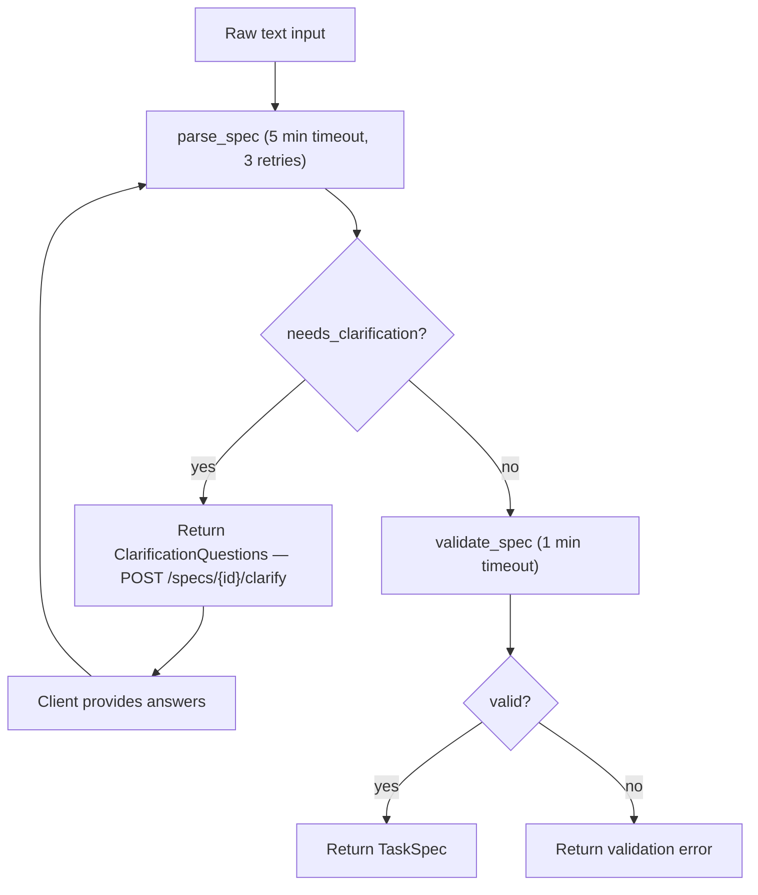
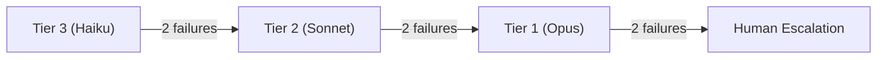
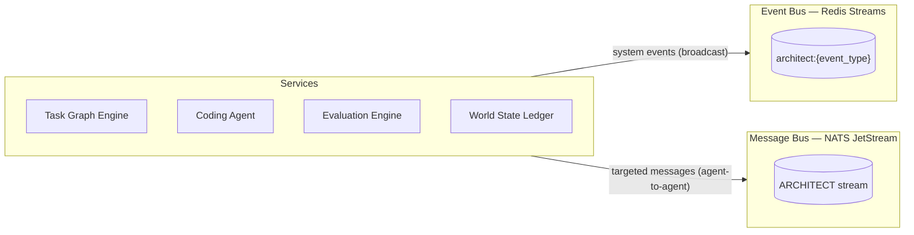
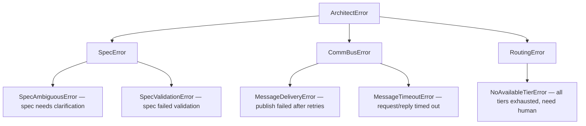

# Phase 2: Detailed Design Document

## Overview

Phase 2 expands ARCHITECT from a single-agent system to a multi-agent system with smarter routing, richer context, inter-agent communication, and full 7-layer evaluation. Where Phase 1 proved the core loop works, Phase 2 makes it collaborative, cost-efficient, and deeply aware of the codebase it's modifying.

## Goals

1. **Enable multi-agent collaboration.** Multiple specialized agents (coder, reviewer, tester, planner) communicate through a typed message bus and share context through the comprehension engine.
2. **Reduce LLM costs by 60--80%.** The Multi-Model Router scores task complexity and routes to the cheapest tier that can handle the work, escalating only on failure.
3. **Transform vague intent into testable specs.** The Spec Engine uses Claude to parse ambiguous descriptions into formal `TaskSpec` objects with acceptance criteria, or asks clarifying questions when it can't.
4. **Complete the evaluation pipeline.** All 7 evaluation layers are active — from compilation through adversarial testing and regression checks.
5. **Provide visual observability.** A React dashboard gives real-time visibility into tasks, agent activity, proposals, and system health.

## Phase 2 Components

| Component              | Service Port | Temporal Task Queue       |
|------------------------|-------------|---------------------------|
| Spec Engine            | 8010        | `spec-engine`             |
| Multi-Model Router     | 8011        | `multi-model-router`      |
| Codebase Comprehension | 8012        | (no Temporal — stateless) |
| Agent Comm Bus         | 8013        | (no Temporal — event bus) |
| Dashboard              | 3000 (dev)  | (React SPA — no backend)  |

Additionally, Phase 2 adds 5 new evaluation layers (L3--L7) to the existing Evaluation Engine on port 8004.

---

## Component Design

### Spec Engine

The Spec Engine is the system's first contact with human intent. It bridges the gap between vague natural-language descriptions and the formal `TaskSpec` model that the Task Graph Engine consumes.

#### LLM-Driven Parsing

The `SpecParser` class takes raw text and sends it to Claude with a structured prompt requesting JSON output. The prompt asks Claude to extract:

- **Intent** — one-sentence summary of what needs to be built
- **Constraints** — technical and non-functional requirements
- **Success criteria** — testable acceptance criteria, each with a test type (`unit`/`integration`/`adversarial`) and automation flag
- **File targets** — which files are likely to be created or modified
- **Assumptions** — what the system assumed to fill gaps
- **Open questions** — ambiguities that need human clarification

The parser strips code fences from the LLM response, extracts JSON, and validates it against the `TaskSpec` schema. Malformed responses trigger retries.

#### Clarification Detection

If the parser determines the input is ambiguous (open questions are not empty), it returns a `SpecResult` with `needs_clarification=True` and a list of `ClarificationQuestion` objects. Each question has a priority (`high`/`medium`/`low`) and contextual explanation. The client answers questions via `POST /api/v1/specs/{id}/clarify`, and the parser re-runs with the answers merged into the prompt.

The `max_clarification_rounds` config (default 3) prevents infinite clarification loops.

#### Validation

`SpecValidator` performs structural checks independently of the LLM:

- Intent must not be empty
- At least one success criterion is required (unless open questions remain)
- No duplicate criterion IDs
- No empty criterion descriptions

#### Clarification Flow



#### Temporal Workflow

`SpecificationWorkflow` orchestrates the full pipeline:

1. Execute `parse_spec` activity (5-minute timeout, 3 retries)
2. Execute `validate_spec` activity (1-minute timeout)
3. Return the combined result

Versioned with `workflow.patched("v1-spec-engine-baseline")` for safe future migration.

#### Data Model

```python
class TaskSpec(ArchitectBase):     # frozen=True
    id: str                        # "spec-{12 hex chars}"
    intent: str
    constraints: list[str]
    success_criteria: list[AcceptanceCriterion]
    file_targets: list[str]
    assumptions: list[str]
    open_questions: list[str]
    created_at: datetime

class AcceptanceCriterion(ArchitectBase):
    id: str                        # "ac-{8 hex chars}"
    description: str
    test_type: Literal["unit", "integration", "adversarial"]
    automated: bool = True
```

#### Storage

Specs are stored in an in-memory dict keyed by spec ID. This is intentional for Phase 2 — persistence to Postgres will be added when the Spec Engine needs to survive restarts across multi-project orchestration (Phase 5).

---

### Multi-Model Router

The Multi-Model Router is the economic brain of the system. It ensures ARCHITECT uses the cheapest model tier that can reliably complete each task, and escalates only when cheaper options fail.

#### Complexity Scoring

`ComplexityScorer` computes a 0.0--1.0 score from four weighted factors:

| Factor | Weight | Scoring Logic |
|--------|--------|---------------|
| Task type | 0.3 | `REVIEW_CODE`=0.8, `FIX_BUG`=0.7, `IMPLEMENT_FEATURE`=0.5, `REFACTOR`=0.4, `WRITE_TEST`=0.2 |
| Token estimate | 0.3 | Linear scale: 0 at 0 tokens, 1.0 at 100k+ tokens |
| Description | 0.2 | Based on character length: short=0.2, medium=0.5, long=0.8 |
| Keywords | 0.2 | Presence of complexity signals: "security", "concurrent", "migration", "refactor", "architecture" |

The final score is `sum(factor * weight)` clamped to [0.0, 1.0].

#### Routing Logic

`Router` applies rules in priority order:

1. **Static overrides** — `REVIEW_CODE` always routes to Tier 1 (needs maximum reasoning), `WRITE_TEST` always routes to Tier 3 (mechanical work)
2. **Threshold routing** — Score > `tier_1_threshold` (0.7) → Tier 1, score > `tier_2_threshold` (0.3) → Tier 2, otherwise → Tier 3
3. **Model assignment** — Tier 1: `claude-opus-4-20250514`, Tier 2: `claude-sonnet-4-20250514`, Tier 3: `claude-haiku-3-20250305`

#### Escalation Policy

`EscalationPolicy` tracks failure history per task:



- `record_failure(task_id, current_tier)` increments the failure counter and returns an `EscalationRecord`
- `should_escalate(task_id)` returns `True` when the failure count at the current tier exceeds `max_tier_failures`
- `next_tier(current)` returns the next higher tier, or `None` if human escalation is needed
- `reset(task_id)` clears the record on success

The `needs_human` flag on `EscalationRecord` is set when all tiers are exhausted. In Phase 3, the Economic Governor will use this to trigger the Human Interface escalation flow.

#### Temporal Activity

`route_task` is a single Temporal activity that instantiates the scorer, router, and escalation policy, computes the decision, and returns a serialized `RoutingDecision`.

---

### Codebase Comprehension

The Codebase Comprehension service gives agents deep understanding of the codebase they're working on. It uses Python's built-in `ast` module — no LLM calls, no external dependencies beyond FastAPI.

#### AST Indexing

`ASTIndexer` parses Python source files and extracts:

- **Functions** — name, parameters, return type annotation, decorators, docstring, async flag, and called functions (by walking `ast.Call` nodes in the body)
- **Classes** — name, base classes, methods (as `FunctionDef` objects), docstring
- **Imports** — module name, imported names, relative/absolute flag

Syntax errors are handled gracefully — the indexer returns an empty `FileIndex` for unparseable files rather than crashing.

`index_directory()` walks a directory with a configurable glob pattern (default `**/*.py`), reads each file, calls `index_file()`, and assembles the results into a `CodebaseIndex` with aggregate counts.

#### Call Graph

`CallGraphBuilder` constructs both forward and reverse call graphs from the indexed function calls:

- Forward graph: function → list of functions it calls
- Reverse graph: function → list of functions that call it

Key format: `file_path::function_name`. This enables cross-file call tracing.

#### Convention Detection

`ConventionExtractor` analyzes the index to detect:

- **Naming patterns** — snake_case function prevalence, PascalCase class prevalence
- **File organization** — presence of `api/`, `temporal/`, `tests/` directories
- **Common patterns** — async function ratio, decorator usage frequency
- **Test patterns** — test file naming (`test_*.py`), test function naming (`test_*`)

This information is fed to coding agents so they write code that matches existing conventions.

#### Context Assembly

`ContextAssembler` is the key consumer-facing component. Given a task description, it:

1. Tokenizes the description into keywords
2. Searches the index for files and symbols matching those keywords (case-insensitive substring)
3. Discovers related test files by looking for `test_<filename>.py` patterns
4. Builds an import graph for matched files
5. Returns a `CodeContext` with relevant files, code chunks, symbols, tests, and imports

This replaces the need for agents to read the entire codebase — they get a focused, relevant context window.

#### Storage

`IndexStore` is an in-memory dict mapping `root_path` → `CodebaseIndex`. Symbol search uses brute-force case-insensitive substring matching across all stored indices. In Phase 3, this will be replaced by a vector database (pgvector or Qdrant) for semantic search.

---

### Agent Communication Bus

The Agent Comm Bus enables typed inter-agent messaging over NATS JetStream. It replaces the previous approach of agents communicating only through shared state in the World State Ledger.

#### NATS JetStream Integration

`MessageBus` wraps the `nats.py` async client:

- **Connect** — establishes a NATS connection and gets a JetStream context. Creates or updates the `ARCHITECT` stream to capture all `architect.>` subjects
- **Publish** — serializes an `AgentMessage` to JSON and publishes to a JetStream subject (e.g., `architect.task.assigned`)
- **Subscribe** — creates a push subscription with an optional queue group for load balancing. Incoming messages are deserialized into `AgentMessage` and passed to the handler
- **Request/Reply** — implements the NATS request pattern with a configurable timeout. Raises `MessageTimeoutError` on timeout
- **Close** — drains all subscriptions and closes the connection

#### Message Types

8 typed message variants cover all inter-agent communication:

| Type | Direction | Purpose |
|------|-----------|---------|
| `task.assigned` | orchestrator → agent | New task assignment |
| `task.completed` | agent → orchestrator | Task finished successfully |
| `context.request` | agent → comprehension | Request codebase context |
| `context.response` | comprehension → agent | Return relevant context |
| `state.proposal` | agent → validator | Propose state mutation |
| `escalation` | agent → orchestrator | Request help or human |
| `disagreement` | agent → arbiter | Conflicting recommendations |
| `knowledge.update` | agent → knowledge cache | New pattern learned |

#### Dead Letter Handling

`DeadLetterHandler` stores messages that fail processing in an in-memory list. Each `DeadLetterEntry` contains the original message, the error string, failure timestamp, and retry count. Operations:

- `handle_failure(message, error)` — adds to the DLQ
- `get_entries(limit)` — returns recent entries for inspection
- `retry(entry_id)` — removes from DLQ and returns `True` if found

In Phase 3, DLQ entries will be persisted to Redis and monitored by the Economic Governor.

#### Statistics

`MessageStats` tracks aggregate counters:

- `total_published` / `total_received` — lifetime message counts
- `by_type` — breakdown by `MessageType` value
- `dead_letter_count` — messages in the DLQ
- `active_subscriptions` — current subscription count

Stats are exposed via `GET /api/v1/bus/stats` for monitoring.

---

### Evaluation Engine Enhancements

Phase 2 adds 5 new evaluation layers, completing the full 7-layer pipeline described in the architecture spec.

#### Layer 3: Integration Tests

`IntegrationTestLayer` runs `pytest -m integration --tb=short -q` in the sandbox. It parses the pytest output for pass/fail counts:

- **PASS** — all integration tests pass
- **FAIL_SOFT** — some tests fail (retryable with broader context)
- **FAIL_HARD** — collection error or complete test infrastructure failure

#### Layer 4: Adversarial Tests

`AdversarialLayer` is the only evaluation layer that uses LLM. It:

1. Sends a prompt to Claude (via `LLMClient`) asking it to generate adversarial test cases for the code in the sandbox — edge cases, null inputs, injection attempts, concurrency issues
2. Writes the generated tests to a file in the sandbox
3. Runs the tests via pytest
4. Classifies findings by severity (`none`/`low`/`medium`/`high`/`critical`)

Verdicts:
- **PASS** — no vulnerabilities found
- **FAIL_SOFT** — low or medium severity findings
- **FAIL_HARD** — high or critical severity findings, or LLM errors

#### Layer 5: Spec Compliance

`SpecComplianceLayer` checks that each acceptance criterion from the spec has a corresponding passing test. It:

1. Runs the full test suite to get the list of passing test names
2. For each acceptance criterion, performs fuzzy keyword matching against test names
3. Computes a compliance score (criteria met / criteria total)

Verdicts:
- **PASS** — all criteria met (score = 1.0)
- **FAIL_SOFT** — score >= 0.5
- **FAIL_HARD** — score < 0.5

#### Layer 6: Architecture Compliance

`ArchitectureComplianceLayer` enforces ARCHITECT's architectural rules:

1. **Cross-service import check** — scans for `from <other_service> import` patterns (services should only import from shared libs)
2. **Lint check** — runs `ruff check` for code quality violations

Verdicts:
- **PASS** — no violations
- **FAIL_SOFT** — lint warnings only
- **FAIL_HARD** — cross-service import violations detected

#### Layer 7: Regression

`RegressionLayer` ensures no existing tests are broken:

1. Runs the full test suite in the sandbox
2. Compares the passing test count against a `baseline_test_count`
3. Checks for newly failing tests

Verdicts:
- **PASS** — all tests pass and count >= baseline
- **FAIL_SOFT** — all pass but count dropped below baseline
- **FAIL_HARD** — regressions detected (previously passing tests now fail)

#### Evaluator Updates

The default layer stack now includes:

```python
[
    CompilationLayer(sandbox_client),          # L1
    UnitTestLayer(sandbox_client),             # L2
    IntegrationTestLayer(sandbox_client),      # L3
    ArchitectureComplianceLayer(sandbox_client), # L6
    RegressionLayer(sandbox_client),           # L7
]
```

`AdversarialLayer` (L4) and `SpecComplianceLayer` (L5) require extra dependencies (`LLMClient` and acceptance criteria respectively) and are added when available. The `enabled_layers` config field controls which layers are active.

---

### Dashboard

The Dashboard is a React 18 + TypeScript + Tailwind CSS single-page application built with Vite. It provides real-time visibility into the ARCHITECT system.

#### Pages

| Page | Route | Purpose |
|------|-------|---------|
| Tasks | `/tasks` | Table of all tasks with status badges, progress, timestamps. Click to drill down |
| Task Detail | `/tasks/:taskId` | Task metadata, progress bar, event timeline, log viewer, cancel button, proposals |
| Health | `/health` | Grid of service cards with health status (green/yellow/red) and version |
| Proposals | `/proposals` | Table of proposals with verdict badges, linked task and agent IDs |

#### Polling

The `usePolling` hook provides 3-second interval polling:

- Stops when the browser tab is hidden (`document.visibilityState === "hidden"`)
- Resumes when the tab becomes visible
- Cleans up the interval on component unmount
- Returns `{ data, error, loading }` tuple

#### API Integration

All requests go through a fetch wrapper (`src/api/client.ts`) that hits the API Gateway at `VITE_API_URL` (default `http://localhost:8000`). The CORS config already allows `http://localhost:3000`.

#### Build

```bash
cd apps/dashboard
bun install
bun run dev    # Dev server on port 3000
bun run build  # Production build to dist/
```

---

## Inter-Component Communication

Phase 2 introduces a second communication channel alongside the existing Redis Streams event bus:

| Channel | Technology | Pattern | Use Case |
|---------|-----------|---------|----------|
| Event Bus | Redis Streams | Pub/sub with consumer groups | System events (task lifecycle, proposals, evaluations) |
| Message Bus | NATS JetStream | Pub/sub, request/reply, queue groups | Direct agent-to-agent communication, context sharing |



The Event Bus (from Phase 1) carries system-wide events that any component can observe. The Message Bus (Phase 2) carries targeted messages between specific agents for coordination.

---

## New Event Types

Phase 2 adds 7 new event types to `EventType`:

| Event | Publisher | Consumers |
|-------|-----------|-----------|
| `spec.created` | Spec Engine | Task Graph Engine |
| `spec.clarification_needed` | Spec Engine | CLI / Dashboard |
| `spec.finalized` | Spec Engine | Task Graph Engine |
| `routing.decision` | Multi-Model Router | Economic Governor (P3) |
| `routing.escalation` | Multi-Model Router | Human Interface (P5) |
| `message.published` | Agent Comm Bus | Monitoring |
| `message.dead_lettered` | Agent Comm Bus | Operations |

---

## New Error Types

Phase 2 adds 8 new exceptions to the `ArchitectError` hierarchy:



---

## Testing Strategy

Phase 2 adds 128 new tests (374 → 502 total):

| Component | Tests | Strategy |
|-----------|-------|----------|
| Spec Engine | 24 | Mock `LLMClient.generate` with canned JSON responses. Test happy path, ambiguity detection, clarification flow, malformed LLM output, validation rules |
| Multi-Model Router | 26 | Pure logic tests — no mocks needed for scorer/router/escalation. Mock `httpx.AsyncClient` for route tests |
| Codebase Comprehension | 28 | Sample Python source strings as test fixtures. AST indexer tests are deterministic. Context assembler uses populated `IndexStore` |
| Agent Comm Bus | 25 | Mock `nats.connect()` and JetStream context. Test serialization, handler dispatch, dead letter handling |
| Eval Engine (5 layers) | 29 | Mock `SandboxClient.execute` with canned `CommandResult` objects. Each layer has 4+ tests: pass, fail_soft, fail_hard, edge case |

All tests run without infrastructure (no Docker, Postgres, Redis, NATS, or Temporal required).

---

## Configuration

Each Phase 2 service follows the Phase 1 pattern: `pydantic_settings.BaseSettings` with a service-specific `env_prefix`.

| Service | Env Prefix | Key Settings |
|---------|-----------|--------------|
| Spec Engine | `SPEC_ENGINE_` | `max_clarification_rounds=3`, `temporal_task_queue="spec-engine"`, `port=8010` |
| Multi-Model Router | `ROUTER_` | `tier_1_threshold=0.7`, `tier_2_threshold=0.3`, `max_tier_failures=2`, `port=8011` |
| Codebase Comprehension | `CODEBASE_` | `max_files_per_index=10000`, `port=8012` |
| Agent Comm Bus | `COMM_BUS_` | `nats_url="nats://localhost:4222"`, `stream_name="ARCHITECT"`, `max_retries=3`, `port=8013` |

---

## What Phase 2 Does NOT Include

Intentionally deferred to later phases:

- **Persistent message bus DLQ** — In-memory only. Redis persistence comes with Phase 3 Economic Governor monitoring
- **Spec persistence to Postgres** — In-memory dict. Database persistence comes when multi-project support is needed
- **Dynamic budget adjustment** — Fixed thresholds. The Economic Governor (Phase 3) will make them dynamic based on burn rate
- **Human escalation UI** — The `needs_human` flag is set but not surfaced. The Human Interface (Phase 5) will consume it

## Phase 2 Additions (pulled forward from Phase 3)

The following were originally deferred to Phase 3 but have been implemented in Phase 2:

- **Vector embeddings for code search** — `ContextAssembler` now supports hybrid semantic + keyword search via pgvector. `TreeSitterIndexer` provides multi-language AST parsing (Python, JavaScript, TypeScript). `EmbeddingGenerator` uses sentence-transformers (`all-MiniLM-L6-v2`) for code embeddings.
- **Spec Engine subagents** — `StakeholderSimulator` role-plays 4 personas (end user, security reviewer, PM, ops engineer). `ScopeGovernor` assesses MVP fitness and flags scope creep.
- **Multi-Model Router cost tracking** — `CostCollector` tracks per-tier token consumption and computes savings vs all-Tier-1 baseline.
- **Git commit integration** — `GitCommitter` in the Coding Agent commits generated code and updates the World State Ledger after evaluation passes.
- **Dashboard task DAG visualization** — React Flow-based interactive graph view with dagre layout.
- **PromptFoo prompt regression testing** — Test suites for spec parsing, code generation, adversarial testing, and stakeholder simulation prompts.
